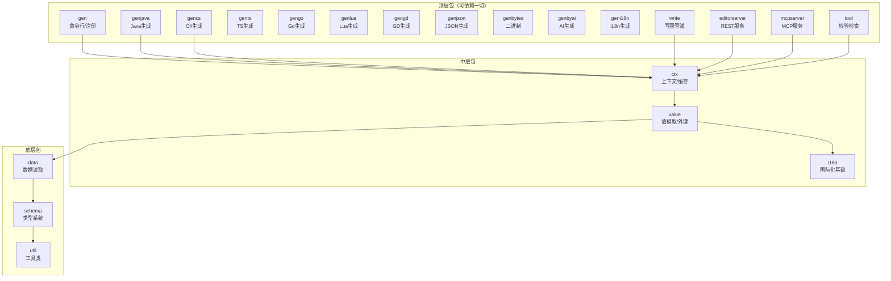

---
AIGC:
  ContentProducer: '001191110102MAD55U9H0F10002'
  ContentPropagator: '001191110102MAD55U9H0F10002'
  Label: '1'
  ProduceID: '1cdd9636-8844-496d-b8b3-fe3bbb93decb'
  PropagateID: '1cdd9636-8844-496d-b8b3-fe3bbb93decb'
  ReservedCode1: '22a8c449-2c81-433b-afb3-5edc1dca5f97'
  ReservedCode2: '22a8c449-2c81-433b-afb3-5edc1dca5f97'
---

# cfggen 代码架构文档

> 本文档基于实际代码结构，提供结构化的代码地图：包/类/职责/依赖关系。便于开发者快速定位代码位置，理解模块间的协作关系。

## 1. 仓库顶层结构

```
cfggen/
├── packages/      # [TypeScript] 核心配置生成器 (cfggen)，monorepo
├── cfgeditor/     # [React+TS] 可视化配置编辑器，Tauri 桌面应用
├── cfgdev/        # 开发工具集（Claude Code 插件 + VSCode 扩展）
├── docs/          # [Astro] 用户文档站点
├── example/       # 多语言代码生成测试示例
├── samples/       # 实际游戏系统配置示例（技能/触发器/剧情）
├── .github/       # CI/CD (GitHub Actions)
├── CHANGELOG.md   # 更新日志（语义化版本）
├── CLAUDE.md      # AI 辅助开发速查
├── README.md      # 项目说明
└── genjar.bat     # 便捷打包脚本（Windows cmd 语法）
```

## 2. packages/ — cfggen 核心生成器

### 2.1 构建配置

| 项 | 值 |
|---|---|
| 构建文件 | `packages/*/package.json` |
| Node.js | 20+ |
| 输出 | `packages/cli/dist/` (pnpm build 产出) |
| 测试 | JUnit 5 + JaCoCo + ArchUnit |
| 源码根 | `packages/*/src/` |
| 测试根 | `packages/*/__tests__/` |
| 模板 | `packages/gen/src/templates/` |

关键依赖：

```groovy
implementation "org.antlr:antlr4-runtime:4.13.2"
implementation "gg.jte:jte:3.2.1"
implementation "org.apache.poi:poi:5.5.1"
implementation "org.dhatim:fastexcel:0.19.0"
implementation 'de.siegmar:fastcsv:4.3.1'
implementation "com.alibaba.fastjson2:fastjson2:2.0.62"
implementation 'io.github.sashirestela:simple-openai:3.21.0'
implementation 'io.github.codeboyzhou:mcp-declarative-java-sdk:0.9.0'
testImplementation 'org.junit.jupiter:junit-jupiter:5.12.2'
testImplementation 'com.tngtech.archunit:archunit-junit5:1.5.0'
```

构建期特殊处理：

| 任务 | 作用 |
|---|---|
| `normalizeJteLineEndings` | 强制 .jte 行尾为 LF（jte 按字节读模板） |
| `jte { generate() }` | 预编译模板成 class 烤进 jar |
| `copyGenJavaSources` | 拷贝运行时读取侧源码到 jar resources |
| `fatJar` | 排除 META-INF/*.SF\|DSA\|RSA，产出可执行 jar |
| `applicationDefaultJvmArgs` | `--sun-misc-unsafe-memory-access=allow`（Node.js 20+ / TypeScript） |

### 2.2 分层依赖规则（ArchUnit 固化）

```
gen(含 gen*/write/editorserver/mcpserver/tool)
    ↓ 单向
   ctx
    ↓ 单向
   value ──→ i18n（value 亦可依赖 i18n）
    ↓ 单向
   data
    ↓ 单向
   schema
    ↓ 单向
   util
```

ArchUnit 测试规则（`ArchitectureTest.java`）：

```java
// 5 条核心规则：
// 1. schema 不得依赖 data/i18n/value/ctx 及顶层
// 2. i18n 不得依赖 data/value/ctx 及顶层
// 3. data 不得依赖 value/ctx 及顶层
// 4. value 不得依赖 ctx 及顶层
// 5. ctx 不得依赖顶层（gen*/write/editorserver/mcpserver/tool）
```

TOP 包列表（最顶层，可依赖一切）：
```java
"..configgen.gen..", "..configgen.genbytes..", "..configgen.genbyai..",
"..configgen.gencs..", "..configgen.gengd..", "..configgen.genjava..",
"..configgen.geni18n..", "..configgen.genjson..", "..configgen.genlua..",
"..configgen.gengo..", "..configgen.gents..",
"..configgen.write..", "..configgen.editorserver..", "..configgen.mcpserver..",
"..configgen.tool.."
```

### 2.3 包级架构图



### 2.4 包详情与入口类

#### gen — 命令行入口 / 插件注册（12 文件）

| 类 | 职责 |
|---|---|
| `Main` | `main()` 入口，注册所有插件，解析参数，构建 Context，调度生成器 |
| `Generator` | 生成器基类，持有 `Parameter`，抽象 `generate(Context)` |
| `GeneratorWithTag` | 带 tag 的生成器基类 |
| `Generators` | 生成器注册表（`LinkedHashMap<String, GeneratorProvider>`） |
| `Tools` | 工具注册表 |
| `ParameterParser` | 参数解析器（边读边 remove，`assureNoExtra` 查多余参数） |
| `ParameterInfoCollector` | 参数文档收集器（与 ParameterParser 双实现） |
| `Parameter` | 参数接口（双实现的统一入口） |
| `Help` | `-h` 帮助打印 |
| `CliException` | 命令行错误（嵌套在 Main 内） |
| `ui/` (5 文件) | GUI 可视化拼命令行界面 |

注册的全部插件（`Main.registerAllProviders`）：

```
Tools:
  xmltocfg, fastexcelcheck, bytesview, term, translate, schematocsv, blockmigrate

Generators:
  verify, search, i18n, i18nbyid,
  java, cs, bytes, lua, ts, go, gd,
  tsschema, json, server, mcpserver, byai
```

#### ctx — 上下文 / 协调 / 缓存（6 文件）

| 类 | 职责 |
|---|---|
| `Context` | 核心协调者：持有 `cfgSchema`、`cfgData`、缓存值；`makeValue(tag, allowErr)` 按需解析值并缓存 |
| `Context.ContextCfg` | 配置参数 record（dataDir, headRow, encoding, i18n 等） |
| `DirectoryStructure` | 数据目录扫描（找 Excel/CSV/JSON 文件） |
| `WatchAndPostRun` | 文件监听 + postrun 钩子（编辑器改完自动重生） |
| `CfgFileInfo` | 文件信息（在 ctx 层，解依赖环用） |
| `ValueEnv` | 值解析环境参数对象（解依赖环用） |

`makeValue` 缓存规则：

```
缓存命中：tag 匹配 + allowErr 方向安全
  - 严格(allowErr=false) 缓存 → 可服务任何请求
  - 宽松(allowErr=true) 缓存 → 只能服务宽松请求
  - 宽松 → 严格：必须重算
```

#### schema — 类型系统 / CFG 文法（37 文件，最大包）

核心类：

| 类 | 职责 |
|---|---|
| `CfgSchema` | schema 容器：`init → resolved` 两阶段，resolve 后冻结 |
| `CfgSchemas` | 多文件并行读取 + 合并 |
| `CfgSchemaResolver` | resolve 全流程（6 步 + 预计算 + 收尾） |
| `StructSchema` | 复合结构定义 |
| `TableSchema` | 数据表定义（主键/entry/唯一键/EntryType） |
| `InterfaceSchema` | 多态接口（impl 列表 + enumRef / defaultImpl） |
| `FieldSchema` | 字段定义（FieldType + FieldFormat） |
| `ForeignKeySchema` | 外键定义（RefPrimary / RefUniq / RefList） |
| `KeySchema` | 键定义 |
| `Metadata` | 万能口袋（tag/comment/fmt/enumRef/nullable...） |
| `CfgSchemaAlignToData` | schema 对齐到数据（在 data 包但逻辑属 schema） |
| `CfgSchemaFilterByTag` | 按 tag 过滤 schema 子集 |
| `CfgSchemaErrs` | schema 错误收集（Err/Warn/WeakWarn 三级） |
| `CfgSchemaException` | schema 错误异常 |

CFG 文法子包 `schema/cfg/`（9 文件）：

| 类 | 职责 |
|---|---|
| `Cfg.g4` | ANTLR 4 文法定义 |
| `CfgReader` | 文本 → schema（只管格式，不管语义） |
| `CfgWriter` | schema → 文本（注释往返不丢） |
| `XmlReader` | XML → schema（替代输入路径） |
| `ThrowingErrorListener` | 语法错抛异常 |

接口层次：

```
Nameable (＋name/fullName/namespace)
  ├── StructSchema
  ├── InterfaceSchema
  └── TableSchema

Structural (＋fields/foreignKeys/fmt/meta)
  ├── StructSchema
  └── TableSchema

Fieldable (可作为字段类型的命名类型)
  ├── StructSchema
  └── InterfaceSchema
```

resolve 流程：

| 步骤 | 做什么 |
|---|---|
| step0 | impl 挂到 interface；表名小写；命名空间冲突检查；建索引 |
| step1 | 解析字段类型 StructRef（interface impl → 本命名空间 → 全局） |
| step2 | 校验 interface/table（entry 字段、主键/唯一键类型） |
| step3 | 解析外键（找 ref 表、校验类型匹配） |
| step4 | fmt 约束（impl 必须 auto；sep 字段必须全 primitive） |
| step5 | 未引用 struct/interface → 警告 |
| 预计算 | 无错时算 Span/HasRef/HasBlock/HasMap/HasText 缓存 |
| 收尾 | 全程无错才 setResolved() |

#### data — 数据读取（19 文件）

| 类 | 职责 |
|---|---|
| `CfgDataReader` | 读取编排（两阶段并发） |
| `CfgData` | 数据模型（`Map<String, DTable>` + 统计） |
| `DTable` | 逻辑表（表头 + 行 + 原始 sheet + nullableAddTag） |
| `DField` | 表头一列（name/comment/suggestedType） |
| `DCell` | 单元格（trim 值 + rowId + col + mode） |
| `DRawSheet` | 原始 sheet/csv |
| `DRawRow` | 行接口（抽象 excel/csv 差异） |
| `ReadByFastExcel` | FastExcel 读取（默认） |
| `ReadByPoi` | POI 读取（备选） |
| `ReadCsv` | CSV/TSV 读取 |
| `HeadParser` | 表头解析（行/列模式） |
| `CellParser` | 单元格解析 |
| `CfgSchemaAlignToData` | schema 对齐到数据（跨包，逻辑属 schema） |

读取管线：

```
阶段1（并发）：读文件 → DRawSheet → 合并进 DTable
阶段2（并发）：每表 → HeadParser → DField + CellParser → DCell 行
```

#### value — 值模型 / 外键校验（30 文件）

sealed 类型树：

```
Value (sealed interface)
├── SimpleValue (sealed interface)
│   ├── CompositeValue (sealed abstract class)
│   │   ├── VStruct (final)       — struct 值，带 note/fold
│   │   ├── VInterface (final)     — interface 值（多态）
│   │   ├── VList (final)          — list 容器
│   │   └── VMap (final)           — map 容器
│   └── PrimitiveValue (sealed interface)
│       ├── VBool (record)
│       ├── VInt (record)
│       ├── VLong (record)
│       ├── VFloat (record)
│       └── StringValue (sealed interface)
│           ├── VString (record)
│           └── VText (final)       — 带 original/translated
└── ContainerValue (sealed interface) — VList, VMap 实现
```

关键类：

| 类 | 职责 |
|---|---|
| `CfgValue` | 值容器（record，含 schema + tables） |
| `CfgValueParser` | 值解析编排（表级并发） |
| `VTable` | 表值（预建主键/唯一键索引 O(1)） |
| `VTableParser` | Excel/CSV 值解析 |
| `VTableJsonParser` | JSON 值解析 |
| `RefValidator` | 外键校验（跨表，收集不抛） |
| `CfgValueErrs` | 值错误收集（Err/Warn 两级） |
| `TextValue` | i18n 直接替换桥 |
| `UnreferencedRecordCollector` | 未引用记录统计 |
| `EntryRecordCollector` | entry 记录统计 |

#### 代码生成器族（gen* 各包）

| 包 | 文件数 | 基类 | 代表产出 |
|---|---|---|---|
| `genjava/` | 22 (+code/ 12) | `JavaCodeGenerator` | Java sealed 类 + 数据 + 运行时读取侧 |
| `gencs/` | 6 | `CsCodeGenerator` | C# 代码（.NET / Unity 兼容） |
| `gents/` | 2 | `TsCodeGenerator` | TypeScript（Config.ts + ConfigUtil.ts） |
| `gengo/` | 5 | `GoCodeGenerator` | Go 结构体 |
| `genlua/` | 13 | `LuaCodeGenerator` | Lua 表（shared 内存优化） |
| `gengd/` | 5 | `GdCodeGenerator` | GDScript（Godot 4.x） |
| `genjson/` | 1 | `JsonGenerator` | JSON 数据 |
| `genbytes/` | 7 | `BytesGenerator` | 二进制数据 |
| `genbyai/` | 8 | `ByAIGenerator` | AI 辅助生成 |
| `geni18n/` | 9 | `I18nBy*Generator` | 翻译文件 |

生成器通用模式：**Model + 模板分离**

```
XxxCodeGenerator.generate(ctx)
  1. ctx.makeValue(tag)  → 拿值
  2. 建 Model 类（StructModel/InterfaceModel/...）
  3. JteEngine.render("lang/Xxx.jte", model, ps) → 写文件
  4. 收尾：CachedFiles.keepMetaAndDeleteOtherFiles（清理过期文件）
```

并发手法：`ThreadLocal<CacheConfig>` 打印机缓冲 + `invokeAll` 表级并发。

收尾清理差异：

| 语言 | dstDir | 清理策略 |
|---|---|---|
| cs / lua | `dir.resolve(pkg路径)` 独占子目录 | `keepMetaAndDeleteOtherFiles` 安全 |
| gd | `dir` 本身 | 同上，需调用方传独占目录 |
| ts | `dir`，默认 `.`（用户项目根） | **不清理**（刻意行为，勿改） |

#### genbytes — 二进制格式（7 文件）

| 类 | 职责 |
|---|---|
| `BytesGenerator` | 生成编排（四段写入） |
| `CfgValueSerializer` | 值序列化（表带长度前缀） |
| `TableSerializer` | 表序列化（无多语言，更快） |
| `MultiLangTableSerializer` | 表序列化（有多语言，记 pk/fieldChain） |
| `StringPool` | 字符串去重池 |
| `LangTextPool` | 多语言文本池（按语言分组） |
| `TextPool` | 单语言文本池 |

文件结构：

```
1. Schema（int=0 无 schema；>0 后跟字节）
2. StringPool（int count + length-prefixed UTF-8）
3. LangTextPool（int langCount + 每语言 TextPool）
4. 表数据（int tableCount + 逐表 name+length+bytes）
全篇小端序
```

#### write + editorserver + mcpserver — 写回管道

| 包 | 文件数 | 入口类 | 职责 |
|---|---|---|---|
| `write/` | 16 | `AddOrUpdateService` / `DeleteService` | 增/改/删记录 → 落盘 → 重建值 |
| `editorserver/` | 8 | `EditorServer` | REST API（`com.sun.net.httpserver`，虚拟线程池） |
| `mcpserver/` | 5 | `CfgMcpServer` | MCP 服务（声明式 SDK，端口 3457） |

写回管道：

```
editorserver REST  ─┐
mcpserver MCP     ─┼→ write.AddOrUpdateService / DeleteService
genbyai           ─┘         │
                             ↓
                    VTableStorage (csv/excel)
                    VTableJsonStorage (json)
                             │
                             ↓
                    TableFile → 文件系统
                             │
                    返回新 CfgValue（服务端原子替换）
```

REST API 路由：

| 方法 | 路由 | 作用 |
|---|---|---|
| GET | `/schemas` | schema 概览 |
| GET | `/search?q=&max=` | 全局搜索 |
| GET | `/record?table=&id=&depth=` | 取记录 |
| GET | `/recordRefIds?table=&id=&in=&out=` | 引用图 |
| POST | `/recordAddOrUpdate?table=` | 增/改记录 |
| DELETE | `/recordDelete?table=&id=` | 删记录 |
| POST | `/checkJson?table=` | 校验 JSON |
| GET | `/prompt?table=` | 生成 AI prompt |

MCP 工具：

| 工具 | 作用 |
|---|---|
| `SchemaTool` | 查表结构 |
| `ReadRecordTool` | 读记录 |
| `WriteRecordTool` | 增/改/删记录 |
| `SearchTool` | 搜索 |

#### tool — 校验 / 检索（9 文件）

| 类 | 注册名 | 职责 |
|---|---|---|
| `ValueVerifyTool` | `verify` | 严格模式校验（有错即抛），CI 门禁 |
| `ValueInspectTool` | `search` | 搜索/交互式查找 |
| `XmlToCfgTool` | `xmltocfg` | XML 转 CFG |
| `ExcelReadDiffTool` | `fastexcelcheck` | FastExcel vs POI 比对 |
| `BytesViewTool` | `bytesview` | Bytes 文件查看 |
| `SchemaToCsvTool` | `schematocsv` | Schema 导出 CSV |
| `BlockMigrationTool` | `blockmigrate` | block 解析迁移检测 |
| `TodoTermListerAndChecker` | `term` | 术语一致性检查 |
| `TodoTranslator` | `translate` | AI 辅助翻译 |

#### i18n / geni18n — 国际化（7 + 9 文件）

两种模式（互斥）：

| 模式 | 参数 | 载体 | 行为 |
|---|---|---|---|
| 直接替换 | `-i18nfile` | `LangTextFinder` | 值解析时就地换成译文 |
| 可切换 | `-langswitchdir` | `LangSwitchable` | 保留全部语言，运行时切换 |

两种键策略（目录结构自动识别）：

| 策略 | 键 | 特点 |
|---|---|---|
| byId | 主键 + fieldChain | 稳定（原文改了翻译仍对应） |
| byValue | 原文本身 | 简单（原文一改翻译失配） |

#### util — 工具类（18 文件）

| 类 | 职责 |
|---|---|
| `JteEngine` | 模板引擎（预编译 / 动态编译双模式） |
| `CachedFiles` | 缓存输出 + 过期文件清理 |
| `CachedIndentPrinter` | 缓存打印机（ThreadLocal 隔离） |
| `CachedFileOutputStream` | 缓存文件输出流 |
| `Logger` | 日志 + 性能 profile |
| `FileNameUtil` | 文件命名约定 |
| `UnicodeReader` | BOM 自动识别 |

### 2.5 测试结构

```
packages/*/__tests__/
├── ArchitectureTest.java    ← ArchUnit 分层依赖测试
├── ...                      ← 各模块的 JUnit 5 测试
```

CI 门禁：`-gen verify` 当配置引用完整性检查。

## 3. cfgeditor/ — 可视化编辑器

### 3.1 构建配置

| 项 | 值 |
|---|---|
| 构建文件 | `cfgeditor/package.json` |
| 框架 | React 19 + TypeScript + Vite |
| 桌面 | Tauri（需 Rust） |
| 包管理 | pnpm |
| Lint | oxlint（含分层依赖强制） |
| 测试 | Vitest（jsdom，纯逻辑） |

### 3.2 分层架构（8 目录 4 组）

```
packages/   ← 入口与壳（CfgEditorApp, AppLoader, i18n）
features/   ← 业务页面（record, table, finder, add, setting）
─────────────────────────────────────
flow/       ← 图与编辑（FlowGraph, EntityCard, layout/）
res/        ← 资源工具（resUtils, findAllResInfos）
─────────────────────────────────────
store/      ← 状态机制（resso.ts, store.ts, storage.ts）
services/   ← 服务（editingSession, queryKeys, clipboard）
─────────────────────────────────────
domain/     ← 纯逻辑（entityModel, schema, embedding, undoStack）
api/        ← HTTP（apiClient, recordModel, schemaModel）
```

依赖规则（`.oxlintrc.json` 强制）：

| 目录 | 不得 import |
|---|---|
| `api/` | `@/domain` `@/store` `@/services` `@/flow` `@/res` `@/features` |
| `domain/` | `@/store` `@/services` `@/flow` `@/res` `@/features` |
| `flow/` | `@/app` `@/features` |
| `store/` | `@/app` `@/features` `@/flow` |
| `services/` | `@/app` `@/features` `@/flow` `@/store` |
| `res/` | `@/app` `@/flow` `@/features` |

### 3.3 核心数据模型

```
record (后端数据)  ┐
                   ├─→  entity (视图模型)  ─→  node + edge  ─→  React Flow 画布
schema (类型信息)  ┘    (recordEditEntityCreator /          (FlowGraph)
                          entityToNodeAndEdge)
```

| 概念 | 层 | 锚点 |
|---|---|---|
| schema | 领域层 | `domain/schema.ts` `Schema` 类；`api/schemaModel.ts` `STable` |
| table | 领域层 | `schemaModel.ts` `STable`（schema 里 `type=='table'`） |
| record | 领域层 | `api/recordModel.ts` `RecordResult`（`(table, id)` 定位） |
| entity | 视图层 | `domain/entityModel.ts` `Entity` 联合类型（只读/可编辑/卡片三态） |
| node | 视图层 | `flow/FlowGraph.tsx` `EntityNode`（React Flow 节点） |
| res | 视图层 | `domain/resInfo.ts` `ResInfo`（资源元数据） |

### 3.4 一条记录的编辑旅程

```
读路径：GET /record + /schemas → React Query 缓存 → entityMap → ELK 布局 → FlowGraph 画图

写路径：
  ① 改值：Form onValuesChange → EditingSession.updateFormValues → 就地改 + markDirty（不重渲）
  ② 500ms 合并：连续键入 = 一步 undo
  ③ 结构编辑：bump structureVersion → 重跑 ELK 布局
  ④ 保存：alt+s → mutate → POST /recordAddOrUpdate → onSuccess 重置缓存
```

### 3.5 关键服务

| 服务 | 文件 | 职责 |
|---|---|---|
| `EditingSession` | `services/editingSession.ts` | 编辑会话核心（跟踪修改、合并提交、结构版本） |
| `UndoStack` | `domain/undoStack.ts` | Undo/Redo 栈 |
| `QueryClient` | `services/queryClient.ts` | React Query 配置（缓存、失效策略） |
| `QueryKeys` | `services/queryKeys.ts` | 缓存键管理 |
| `Clipboard` | `services/clipboard.ts` | 剪贴板 |
| `ThemeService` | `services/themeService.ts` | 主题 |

## 4. cfgdev/ — 开发工具集

```
cfgdev/
├── skills/                  # Claude Code 插件
│   └── ...                  # 根据自然语言生成 .cfg schema、数据
└── vscode-cfg-extension/    # VSCode 扩展
    └── ...                  # .cfg 语法高亮、跳转定义、大纲视图
```

## 5. docs/ — 用户文档站

```
docs/
├── astro.config.mjs         # Astro 配置
├── src/
│   ├── content.config.ts
│   └── content/docs/
│       ├── index.mdx         # 首页
│       ├── quickstart.mdx    # 快速开始
│       ├── core/             # 核心文档
│       │   ├── schema.mdx    # Schema 语法
│       │   ├── cli.mdx       # 命令行
│       │   ├── key.mdx       # 主键/外键
│       │   ├── tag.mdx       # Tag
│       │   ├── i18n.mdx      # 国际化
│       │   ├── verify.mdx    # 校验
│       │   └── ...
│       ├── editor/           # 编辑器文档
│       ├── ai/               # AI 文档
│       └── arch/             # 架构案例
└── package.json
```

## 6. example/ 与 samples/

### example/ — 多语言生成测试

```
example/
├── config/              # 配置源（.cfg + Excel/CSV/JSON）
│   ├── config.cfg       # 公共结构定义
│   ├── ai_行为/         # AI 行为配置
│   ├── equip/           # 装备配置
│   ├── other/           # 其他配置
│   └── task/            # 任务配置
├── java/                # Java 代码（单语言）
├── java_ls/             # Java 代码（多语言服务端）
├── cs/ cs_ls/ cs_ls_client/  # C# 代码（三种模式）
├── go/ go_ls/ go_ls_client/  # Go 代码（三种模式）
├── ts/ ts_ls/ ts_ls_client/  # TypeScript 代码（三种模式）
├── lua/ lua_ls_client/       # Lua 数据（两种模式）
├── gd/ gd_ls_client/         # GDScript 代码（两种模式）
├── i18n/ i18n_method1/      # 国际化示例
└── *.bat                # 各语言生成脚本
```

后缀说明：

| 后缀 | 说明 |
|---|---|
| 无后缀 | 单语言版本 |
| `_ls` | 多语言服务器端（文本全） |
| `_ls_client` | 多语言客户端（运行时切换） |

### samples/ — 实际游戏配置示例

| 目录 | 内容 |
|---|---|
| `buff/` | 技能系统（星际 ABE 架构：Ability-Behavior-Effect） |
| `trigger/` | 触发器系统（副本事件、NPC 事件、玩家事件） |
| `video/` | 剧情对话系统（条件判断、对话选项） |
| `test/` | CFG 语法特性综合测试 |

## 7. CI/CD

```
.github/workflows/
├── pages.yml     # 文档站部署到 GitHub Pages
└── release.yml   # 发布构建
```

## 8. 关键类索引（按职责快速查找）

### 我想...

| 要做的事 | 看哪个类 |
|---|---|
| 理解命令行入口 | `gen/Main.java` |
| 理解 Context 缓存 | `ctx/Context.java` 的 `makeValue` |
| 看 schema 如何建模 | `schema/CfgSchema.java`, `schema/CfgSchemaResolver.java` |
| 看 CFG 文法 | `schema/cfg/Cfg.g4`, `schema/cfg/CfgReader.java` |
| 理解数据读取 | `data/CfgDataReader.java` |
| 理解外键校验 | `value/RefValidator.java` |
| 看值类型树 | `value/CfgValue.java` |
| 加新语言生成器 | 参考 `gencs/CsCodeGenerator.java` + `gen/Generator.java` |
| 改代码生成模板 | `packages/gen/src/templates/<lang>/` |
| 理解二进制格式 | `genbytes/BytesGenerator.java` |
| 理解写回管道 | `write/AddOrUpdateService.java` + `write/VTableStorage.java` |
| 看编辑器 API | `editorserver/EditorServer.java` |
| 看 MCP 服务 | `mcpserver/CfgMcpServer.java` |
| 看校验逻辑 | `tool/ValueVerifyTool.java` |
| 理解分层依赖 | `test/ArchitectureTest.java` |
| 看 JTE 模板引擎 | `util/JteEngine.java` |
| 看前端编辑会话 | `cfgeditor/src/services/editingSession.ts` |
| 看前端布局引擎 | `cfgeditor/src/flow/layout/` |
| 看前端数据流 | `cfgeditor/src/api/` + `cfgeditor/docs/01-data-flow.md` |
| 看前端 Undo/Redo | `cfgeditor/src/domain/undoStack.ts` |

> AI生成