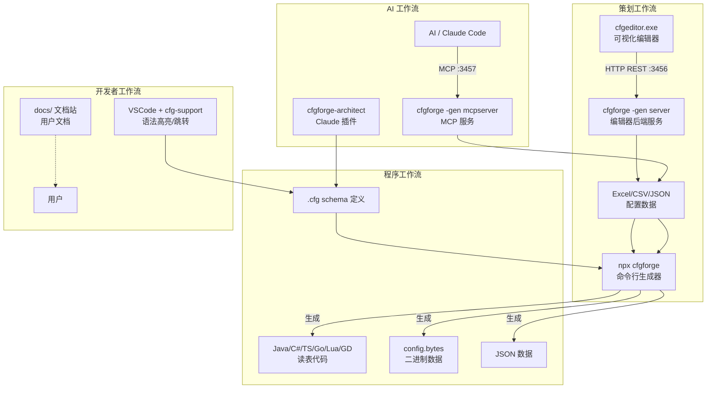
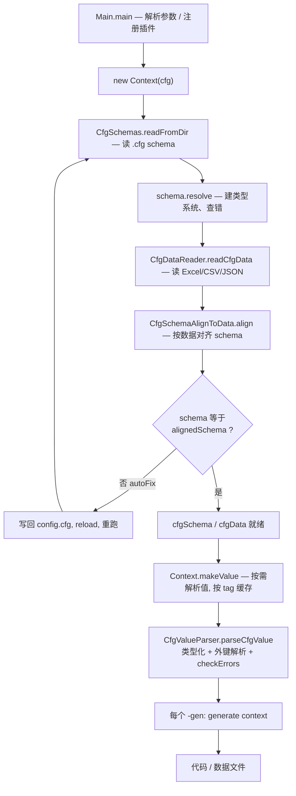

---
AIGC:
  ContentProducer: '001191110102MAD55U9H0F10002'
  ContentPropagator: '001191110102MAD55U9H0F10002'
  Label: '1'
  ProduceID: '38dd05aa-e176-4cda-8448-bf1705ac347e'
  PropagateID: '38dd05aa-e176-4cda-8448-bf1705ac347e'
  ReservedCode1: '8f104a58-90e3-4260-b4d3-1de38cf505f6'
  ReservedCode2: '8f104a58-90e3-4260-b4d3-1de38cf505f6'
---

# cfgforge 策划配表系统 — 项目总览架构文档

> 本文档从全局视角介绍 cfgforge 项目：四个组件如何协作、数据如何流转、系统全景架构。适合新成员快速建立心智模型，也可作为项目交接参考。

## 1. 项目定位

cfgforge 是一个**配置定义驱动**的多语言代码生成器，面向游戏开发团队解决以下问题：

- 策划在 Excel/CSV/JSON 中维护配置数据
- 程序需要类型安全的代码来访问这些配置
- 配置间存在外键引用，需要数据一致性校验
- 不同端（服务端/客户端）需要不同的配置子集
- 多语言文本需要管理和切换

一句话概括核心数据流：

> **Schema（类型系统）→ Data（原始数据）→ Value（类型化值）→ Generate（代码/数据输出）**

## 2. 系统全景

### 2.1 四大组件

```
┌──────────────────────────────────────────────────────────────────┐
│                        cfgforge 策划配表系统                         │
│                                                                    │
│  ┌─────────────┐   ┌──────────────┐   ┌───────────┐   ┌─────────┐ │
│  │  packages/  │   │  cfgeditor/  │   │  cfgdev/  │   │  docs/  │ │
│  │  (cfgforge)   │   │  (编辑器)     │   │ (开发工具) │   │ (文档站) │ │
│  │             │   │              │   │           │   │         │ │
│  │ TypeScript  │   │ React 19+TS  │   │ Claude插件 │   │ Astro+  │ │
│  │ pnpm        │   │ Tauri桌面    │   │ VSCode扩展 │   │ Starlight│ │
│  │             │   │              │   │           │   │         │ │
│  │ TS monorepo │   │ 8层目录架构   │   │ 2个子项目  │   │ 在线文档 │ │
│  └──────┬──────┘   └──────┬───────┘   └───────────┘   └─────────┘ │
│         │                   │                                        │
│         │    HTTP :3456     │                                        │
│         └───────────────────┘                                        │
│           REST API                                                  │
└──────────────────────────────────────────────────────────────────┘
```

| 组件 | 目录 | 技术栈 | 职责 | 规模 |
|---|---|---|---|---|
| **cfgforge** | `packages/` | TypeScript, pnpm | 核心生成器：从 .cfg schema + Excel/CSV/JSON → 6+ 语言代码/数据 | TypeScript monorepo |
| **cfgeditor** | `cfgeditor/` | React 19 + TypeScript + Tauri | 可视化浏览器/编辑器：浏览+编辑表结构和记录 | 8 目录分层架构 |
| **cfgdev** | `cfgdev/` | Claude Code 插件 + VSCode 扩展 | 开发工具集：自然语言生成 schema + .cfg 语法高亮 | 2 个子项目 |
| **docs** | `docs/` | Astro + Starlight | 用户文档站点（在线部署） | 含语法/CLI/编辑器/AI 文档 |

### 2.2 组件协作关系



### 2.3 数据流转全景

```
                    ┌─────────────────────────────────────────────────┐
                    │              磁盘文件                             │
                    │  .cfg schema  │  Excel/CSV/JSON  │  config.bytes  │
                    └───────┬───────┴────────┬──────────┴───────┬──────┘
                            │                │                   │
                    ┌───────▼───────┐ ┌──────▼───────┐    ┌──────▼──────┐
                    │  Schema 层     │ │  Data 层      │    │  Generate 层 │
                    │  (类型系统)    │ │  (原始单元格)  │    │  (代码输出)  │
                    │                │ │               │    │              │
                    │  CfgSchema    │ │  CfgData      │    │  Java/C#/TS  │
                    │  StructSchema │ │  DTable       │    │  Go/Lua/GD   │
                    │  TableSchema  │ │  DCell        │    │  Bytes/JSON  │
                    │  InterfaceSch  │ │  DRawSheet    │    │              │
                    └───────┬───────┘ └──────┬───────┘    └──────▲──────┘
                            │                │                    │
                            └───────┬────────┘                    │
                            ┌──────▼───────┐                       │
                            │  Value 层     │ ──────────────────────┘
                            │  (类型化值)   │
                            │               │
                            │  CfgValue     │
                            │  VTable       │
                            │  VStruct      │
                            │  VInterface   │
                            │  RefValidator │
                            └──────────────┘
```

**四层各管一件事，单向依赖：**

- **Schema** 是类型系统，能脱离任何数据存在（先有结构定义）
- **Data** 是原始单元格，只关心文件格式，不做类型解释
- **Value** 是类型化、外键已解析的运行时模型
- **Generate** 是消费方

`Context` 是把它们串起来、并缓存中间产物的协调者。

## 3. 核心组件详解

### 3.1 packages/ — cfgforge 核心生成器

#### 技术栈

| 项 | 值 |
|---|---|
| 语言 | TypeScript |
| 构建 | pnpm -r build |
| 主要依赖 | FastExcel 0.19, POI 5.5, FastJSON2 2.0, JTE 3.2, ANTLR 4.13, Simple-OpenAI 3.21, MCP SDK 0.9 |
| 测试 | JUnit 5 + JaCoCo + ArchUnit |
| 模板引擎 | JTE (构建期预编译进 jar) |

#### 包结构（monorepo 多包）

```
configgen/
├── gen/              命令行入口 / 插件注册 (12 文件)
├── ctx/              上下文 / 协调 / 缓存 (6 文件)
├── schema/           类型系统 / CFG 文法 (37 文件)
│   └── cfg/          ANTLR 文法 + 读写器 (9 文件)
├── data/             数据读取 (19 文件)
├── value/            值模型 / 外键校验 (30 文件)
├── genjava/          Java 代码生成 (22 文件)
│   └── code/         Java 生成 Model 类 (12 文件)
├── gencs/            C# 代码生成 (6 文件)
├── gents/            TypeScript 代码生成 (2 文件)
├── gengo/            Go 代码生成 (5 文件)
├── genlua/           Lua 代码生成 (13 文件)
├── gengd/            GDScript 代码生成 (5 文件)
├── genjson/          JSON 数据生成 (1 文件)
├── genbytes/         二进制格式生成 (7 文件)
├── genbyai/          AI 辅助生成 (8 文件)
├── geni18n/          国际化文件生成 (9 文件)
├── i18n/             国际化基础设施 (7 文件)
├── write/            写回管道 (16 文件)
├── editorserver/     REST API 服务 (8 文件)
├── mcpserver/        MCP 服务 (5 文件)
├── tool/             校验 / 检索工具 (9 文件)
└── util/             模板 / 缓存输出 / 日志 (18 文件)
```

#### 分层依赖（ArchUnit 固化）

```
gen(含 gen*/write/editorserver/mcpserver/tool)
    ↓
   ctx
    ↓
   value ──→ i18n
    ↓
   data
    ↓
   schema
    ↓
   util
```

下层 import 上层会直接导致 ArchitectureTest 测试失败。

#### 插件注册表

所有 `-gen` 和 `-tool` 通过注册表扩展，加一个新语言只需：

1. 新建 `gen<lang>` 包，写 `XxxCodeGenerator extends Generator`
2. 构造函数里声明参数（`parameter.get("dir", "...")`）
3. `generate(ctx)`：`ctx.makeValue(tag)` → 建 Model → `JteEngine.render()`
4. 模板放 `packages/gen/src/templates/lang/`
5. 在 `Main.registerAllProviders` 加一行 `Generators.addProvider("lang", XxxCodeGenerator::new)`

当前注册的生成器：

| 注册名 | 类 | 产出 |
|---|---|---|
| `java` | `JavaCodeGenerator` | Java 代码 + 数据（sealed 类） |
| `cs` | `CsCodeGenerator` | C# 代码（.NET / Unity） |
| `ts` | `TsCodeGenerator` | TypeScript 代码 |
| `go` | `GoCodeGenerator` | Go 代码 |
| `lua` | `LuaCodeGenerator` | Lua 表（内存优化） |
| `gd` | `GdCodeGenerator` | GDScript（Godot 4.x） |
| `json` | `JsonGenerator` | JSON 数据 |
| `bytes` | `BytesGenerator` | 二进制数据 |
| `verify` | `ValueVerifyTool` | 配置引用完整性校验 |
| `search` | `ValueInspectTool` | 配置检索 |
| `i18n` | `I18nByValueGenerator` | 翻译文件（byValue） |
| `i18nbyid` | `I18nByIdGenerator` | 翻译文件（byId） |
| `server` | `EditorServer` | REST API 服务 |
| `mcpserver` | `CfgMcpServer` | MCP AI 服务 |
| `byai` | `ByAIGenerator` | AI 辅助生成 |
| `tsschema` | `TsSchemaGenerator` | 导出 TS schema |
| `javamapper` | `JavaMapperGenerator` | Java mapper 类（MySQL 运行时加载，`DataStoreCompat` + PBData 推送，强类型 POJO，替代 Python autoCfgFile.py） |

#### 端到端流水线



`Context` 在构造时就把 schema 和 data 读完并对齐；`makeValue` 在第一个生成器需要值时按需解析并缓存。

### 3.2 cfgeditor/ — 可视化配置编辑器

#### 技术栈

| 项 | 值 |
|---|---|
| 框架 | React 19 + TypeScript + Vite |
| 桌面 | Tauri（需 Rust） |
| UI | Ant Design v6 |
| 图形 | React Flow (XYFlow) + ELK 布局引擎 |
| 状态 | Resso + React Query |
| 测试 | Vitest (jsdom, 纯逻辑) |
| Lint | oxlint (含分层依赖强制) |

#### 分层架构（8 目录 4 组，依赖只能向下）

```
packages/   入口与壳：CfgEditorApp, AppLoader, i18n
features/   业务页面：record, table, finder, headerbar, add(Chat), setting
─────────────────────────────────────────────────
flow/       图与编辑：FlowGraph, EntityCard, useEntityToGraph, layout/
res/        资源工具：resUtils, findAllResInfos
─────────────────────────────────────────────────
store/      状态机制：resso.ts, store.ts, storage.ts
services/   服务：editingSession, queryKeys, clipboard, themeService
─────────────────────────────────────────────────
domain/     纯逻辑：entityModel, schema, embedding, undoStack
api/        HTTP：apiClient, recordModel, schemaModel, searchModel
```

oxlint 的 `no-restricted-imports` 强制分层，反向 import 立即被拦下。

#### 核心数据流

```
record (数据)  ┐
               ├─→  entity (视图模型)  ─→  node + edge  ─→  React Flow 画布
schema (类型)  ┘    (recordEditEntityCreator /          (FlowGraph)
                      entityToNodeAndEdge)
```

cfgeditor 是**瘦前端**，所有数据来自 TypeScript editor-core（直接 import）。编辑就是反着走：在 node 表单里改值 → 写回 record 数据对象 → POST 回后端。

### 3.3 cfgdev/ — 开发工具集

| 子项目 | 技术 | 功能 |
|---|---|---|
| `cfgforge-architect` (skills/) | Claude Code 插件 | 根据自然语言生成 .cfg schema、数据（.cfg/csv/json） |
| `cfg-support` (vscode-cfg-extension/) | VSCode 扩展 | .cfg 文件语法高亮、跳转定义、大纲视图 |

### 3.4 docs/ — 用户文档站点

基于 Astro + Starlight 构建的用户文档站点，部署在 GitHub Pages。

| 文档分类 | 内容 |
|---|---|
| `core/` | Schema 语法、CLI、主键/外键、表格映射、tag、i18n、校验 |
| `editor/` | 编辑器安装、界面功能、操作说明、高级功能 |
| `ai/` | AI 辅助生成、MCP 服务、翻译工具 |
| `arch/` | 游戏配置架构设计案例（技能/触发器/剧情） |

## 4. 关键设计决策

### 4.1 为什么以 Context 为中心

`Context` 是唯一持有 `cfgSchema`、`cfgData` 和缓存值的地方。所有生成器和服务器都接收 `Context` 取数据，而不是各自去读文件。

好处：读+对齐+缓存的逻辑只写一遍；生成器退化为"取值 → 渲染"，极其轻量；服务器和命令行复用同一套已对齐的数据。

### 4.2 为什么 Schema / Data / Value / Generate 分四层

核心是**职责单一 + 单向依赖**：

- 换数据源只动 `data`
- 换目标语言只加一个 `gen*`
- 换校验策略只动 `value` / `tool`

### 4.3 为什么数据驱动 Schema（auto-fix）

数据是事实来源——策划在 Excel 里加了列，schema 必须跟上。`Context` 构造时比较 `schema` 与按数据对齐后的 `alignedSchema`：若不一致且开启 `autoFix`，把对齐后的 schema 写回 `config.cfg`、reload、再重跑。代价是 `config.cfg` 会被程序改写。

### 4.4 为什么 makeValue 要缓存，且 allowErr 有方向

一次运行常挂多个 `-gen`（如同时 `-gen java,bytes`），解析全部值很贵，所以 `makeValue` 按 tag 缓存复用。

缓存命中规则刻意堵死宽松 → 严格方向：
- 严格（`allowErr=false`）缓存的值保证无错，能服务任何请求
- 宽松（`allowErr=true`）缓存的值可能带错，只能服务宽松请求

否则编辑器的容忍值会被生成器复用，跳过校验把脏值写进产物。

### 4.5 为什么用收集式错误而非遇错即抛

一份配表可能同时有 20 处错。遇第一个就抛，策划得"改一处→重跑→看下一处"循环 20 次；收集后一次列出全部，改完再跑。

### 4.6 为什么用插件注册表

`Generators.addProvider(name, ctor)` 把名字映射到构造器。加新语言或新工具只需：继承基类 + 登记一行 + 放模板。

## 5. 典型使用场景

### 场景 1：生成 Java 读表代码

```bash
npx cfgforge -datadir example/config -gen java,dir:example/java
```

### 场景 2：生成多语言客户端 + 服务端

```bash
# C# 服务端（包含所有语言文本）
npx cfgforge -datadir example/config -langswitchdir i18n -gen cs,dir:example/cs_ls

# C# 客户端（运行时切换语言）
npx cfgforge -datadir example/config -langswitchdir i18n -gen cs,dir:example/cs_ls_client
```

### 场景 3：CI 校验配置完整性

```bash
npx cfgforge -datadir config -gen verify
# 有引用错误则非零退出码，CI 失败
```

### 场景 4：启动编辑器

```bash
# 终端 1：启动后端
npx cfgforge -datadir example/config -gen server,watch=1

# 终端 2：启动前端
cd cfgeditor && pnpm run dev
# 浏览器打开 http://localhost:1420/
```

### 场景 5：生成二进制发布数据

```bash
npx cfgforge -datadir config -gen bytes,schema -gen java,dir:src
# 产出 config.bytes（含 schema 自描述）+ Java 读取代码
```

## 6. 技术栈速查

| 层面 | 技术 |
|---|---|
| 核心生成器 | Node.js 20+, pnpm, JTE 模板, ANTLR 4, FastExcel, POI, FastJSON2 |
| 可视化编辑器 | React 19, TypeScript, Tauri, Ant Design, React Flow, Resso |
| AI 集成 | Simple-OpenAI, MCP SDK, Claude Code 插件 |
| 开发工具 | VSCode 扩展 (LSP), oxlint (分层强制) |
| 文档站 | Astro, Starlight |
| 测试 | JUnit 5, JaCoCo, ArchUnit, Vitest |
| CI/CD | GitHub Actions (pages.yml, release.yml) |

## 7. 文档索引

| 文档 | 位置 | 受众 |
|---|---|---|
| 本文档（项目总览） | `PROJECT_OVERVIEW.md` | 所有人 |
| 开发者入门指南 | `DEVELOPER_GUIDE.md` | 新开发者 |
| 代码架构文档 | `CODE_ARCHITECTURE.md` | 开发者（代码导航） |
| cfgforge 源码设计系列 | `packages/ 对应文档` | cfgforge TypeScript 开发者 |
| cfgeditor 源码设计系列 | `cfgeditor/docs/01-09` | cfgeditor 前端开发者 |
| 用户文档站 | `docs/src/content/docs/` | 最终用户（策划/程序） |
| CLAUDE.md | 各子目录根 | AI 辅助开发速查 |

> AI生成